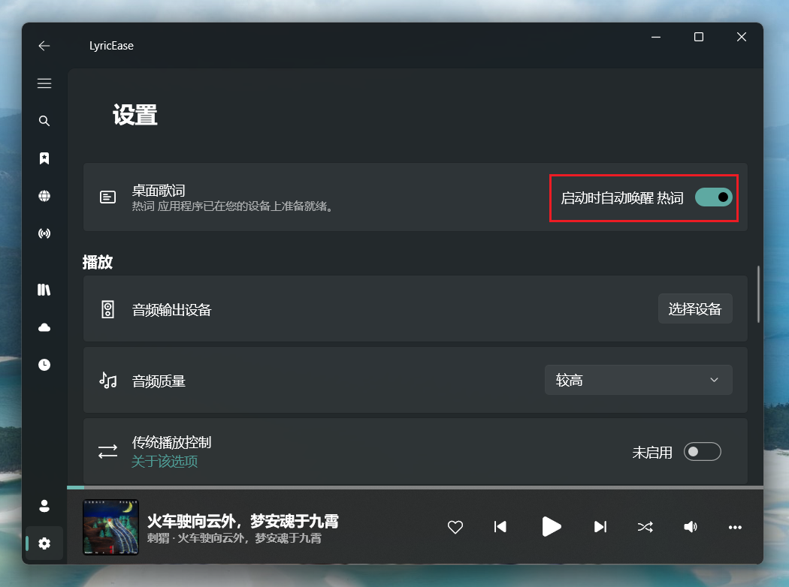
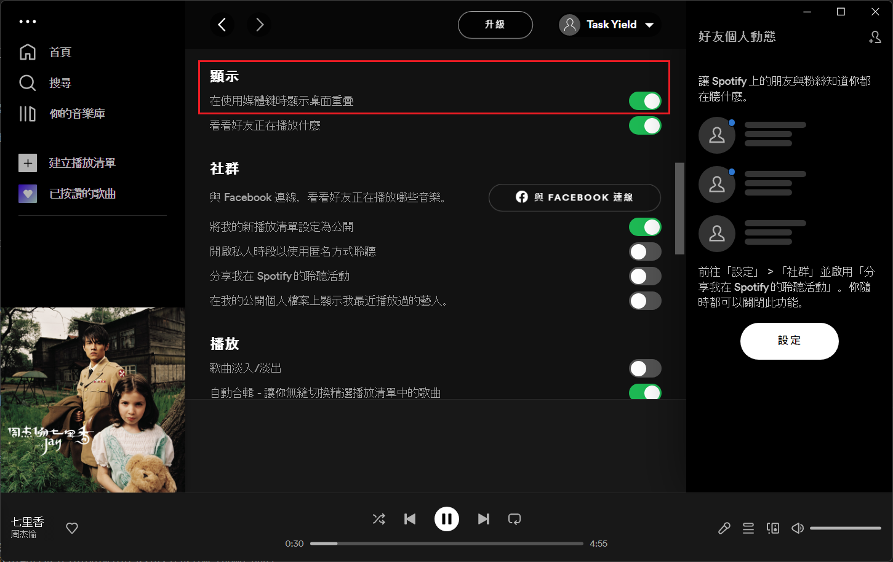
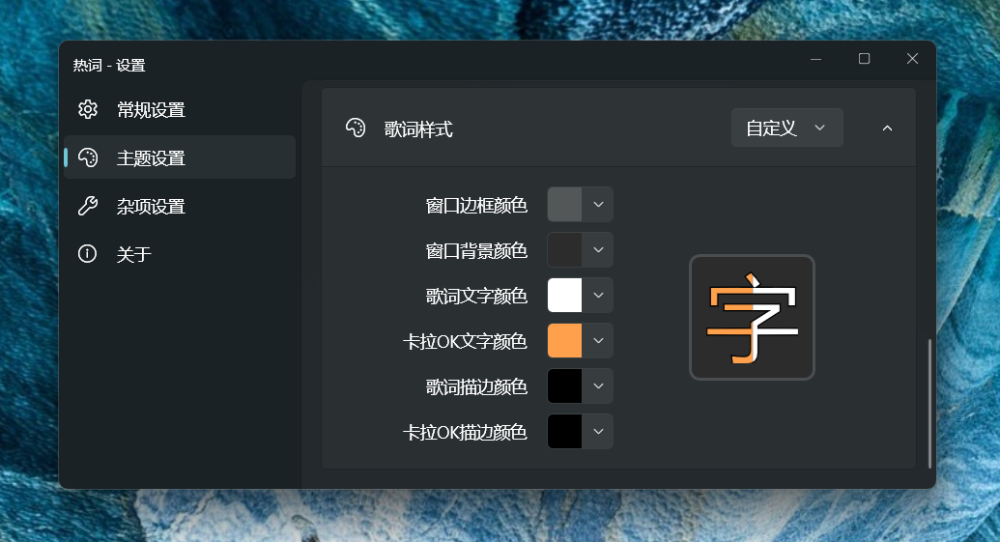

# 热词

为其他播放器提供桌面歌词。

下载地址: [https://www.microsoft.com/store/productId/9MXFFHVQVBV9](https://www.microsoft.com/store/productId/9MXFFHVQVBV9)

交流与反馈: [QQ群 1145646224](https://jq.qq.com/?_wv=1027&k=K4Ixe2Gw)

v1.3.0 后从 wpf 移植到 winui3 框架。由于winui3框架还远远谈不上稳定，新版本的问题相比旧版本会更多，如果遇到问题麻烦及时反馈。

## 软件截图

## 支持的播放器   
|播放器|支持程度|
|---|---|
|HyPlayer|完全支持
|LyricEase|完全支持
|[Spotify](https://www.spotify.com/)|歌词可能匹配不准确<a href="#ref1">1</a>
|[网易云音乐 UWP](https://github.com/JasonWei512/NetEase-Cloud-Music-UWP-Repack)<a href="#ref2">2</a>|歌词可能匹配不准确<a href="#ref1">1</a> 无法获取进度<a href="#ref3">3</a>
|[QQ音乐 UWP](https://www.microsoft.com/store/productId/9WZDNCRFJ1Q1)|歌词可能匹配不准确<a href="#ref1">1</a> 无法获取进度<a href="#ref3">3</a> 无法获取歌曲信息<a href="#ref4">4</a>
|[媒体播放器（Groove 音乐）](https://www.microsoft.com/store/productId/9WZDNCRFJ3PT)|歌词可能匹配不准确<a href="#ref1">1</a>
|[Foobar2000 (v1.5.1+)](https://www.foobar2000.org/)|歌词可能匹配不准确<a href="#ref1">1</a> 无法获取进度<a href="#ref3">3</a>
|[MusicBee (需要第三方插件)](https://getmusicbee.com/)|需要第三方插件<a href="#ref5">5</a> 歌词可能匹配不准确<a href="#ref1">1</a> 无法获取进度<a href="#ref3">3</a>
|[YesPlayerMusic](https://github.com/qier222/YesPlayMusic)|完全支持（请使用最新版）
|[Apple Music Preview](https://www.microsoft.com/store/productId/9PFHDD62MXS1)|歌词可能匹配不准确<a href="#ref1">1</a>
---

1. 由于热词对这些播放器的歌词匹配基于歌名歌手搜索，所以匹配可能不精准或匹配不到。
2. 请使用 [UWP 不更新版](https://github.com/JasonWei512/NetEase-Cloud-Music-UWP-Repack)，微软商店最新版为 Win32 版，非 UWP 版。
3. 由于播放器未提供进度信息，热词使用内置定时器更新歌词进度，所以当手动修改播放进度后热词将无法匹配到正确的歌词。
4. 可能无法获取到QQ音乐UWP的播放信息，先开启QQ音乐UWP再启动热词可以缓解。
5. MusicBee 需要安装 [mb_MediaControl](https://github.com/LasmGratel/mb_MediaControl/releases) 来与系统 SMTC 交互。

## 已知问题
* 移除了倍速播放的支持。
* 出现全屏窗口时自动隐藏的功能还在开发中，暂时隐藏设置中的选项。
* Windows 10 中先开启热词再开启播放器，热词可能无法正常显示，调查中。
* Windows 10 中关闭所有播放器时热词可能不会自动隐藏。

## 如何打开

### HyPlayer
安装热词后，在主界面中点击桌面歌词按钮。

### LyricEase
安装热词后，在设置中启用桌面歌词选项。  

### Spotify
Spotify 需要在设置中开启 **在使用媒体键时显示桌面重叠**

## 使用说明

### 锁定歌词

选中后歌词界面将无法点击和拖拽。在 **通知区域图标上右键** 或 **设置界面中** 或 **双击通知区域图标** 即可解除锁定。

### 性能设置

如果感觉热词占用资源过多，可以打开 **低功耗模式** 以降低资源占用。

**低功耗模式** 设置为 **自动** 时，移动设备在未充电状态，如果系统中开启了 *节电模式* 或 *能效优先* ，则会自动开启低功耗模式。

如果歌词界面渲染错误，请加交流群，或提交Issues，或在设置界面中点击 **反馈问题** 按钮联系我。

### 歌词样式

如果不喜欢预设的歌词样式，可以在右侧切换到自定义模式，调整界面上的每种颜色。

### 开机启动
当在任务管理器中 **启用** 了热词的开机启动项时，应用内的开机启动选项才能设置。

### 重置窗口位置
如果窗口被拖动到显示器区域外，可以使用此选项恢复窗口的默认位置。

## 第三方通知
[第三方通知](HotLyric/HotLyric.Package/ThirdPartyNotices.txt)
